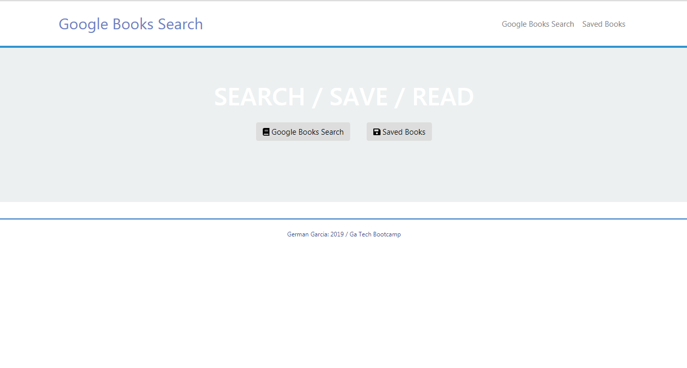

# Google Books Search
 
Google Books Search is a REACT-based application which connects to `www.googleapis.com` to search for book titles. 

## How it works

1. User comes to landing page where there are two options:
    - `Google Books Search`
    - `Saved Books`

2. `Google Books Search` displays a text book and a `Search` button. User can search for the book titles entered and the application will render the search the results. 
    - Search results include the book title, description/summary, and the book image
    - User can save the book he/she likes into the MongoDb database

3. `Saved Books` option will bring the information from the MongoDb database
    - User has the option to delete the book from the DB.

## Application

You can check the deployed version of the application at https://shielded-inlet-79715.herokuapp.com/ 
